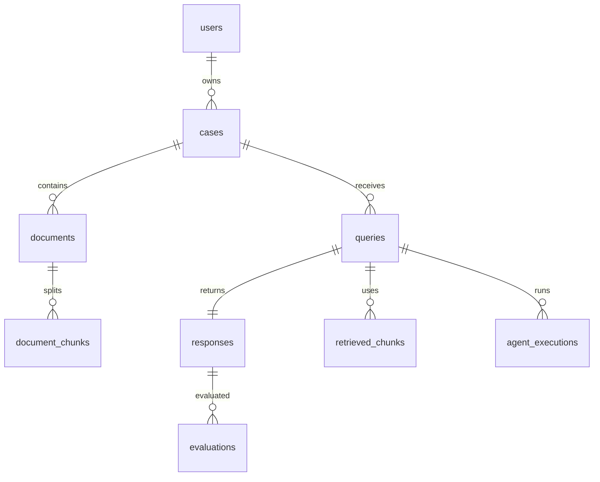

# Veredicta AI

Veredicta AI — plataforma GenAI modular para analise documental juridica com RAG avancado e motores multi-agent, escalavel, auditavel e pronta para uso enterprise.


## High-Level Architecture

```mermaid
flowchart LR
	A[Ingestion] --> B[Embeddings]
	B --> C[Vector Store (pgvector)]
	C --> D[RAG Engine]
	D --> E[Multi-Agent Orchestration]
	E --> F[API Layer]
```

## Banco de dados (MER)



Diagrama em imagem: [img/DER.png](img/DER.png)
Fonte Mermaid: [docs/der.mmd](docs/der.mmd)
Detalhes completos em [db_postgress.md](db_postgress.md).

## Estrutura do projeto

- `backend/` API FastAPI + pipelines de RAG e Multi-Agent
- `docker/` stack Docker Compose com PostgreSQL + pgvector
- `docs/` documentacao tecnica e arquitetura
- `tests/` testes unitarios e integrados
- `img/` assets visuais (`logo.png`, `fiveicon.ico`)

## Pré-requisitos

- Docker + Docker Compose

## Subir ambiente local

1. Revise as variáveis em `.env.example`.
2. No diretório `docker/`, execute:

```bash
docker compose --project-name veredicta-ai up --build -d
```

3. Acesse a API em `http://127.0.0.1:8011`.

## Coexistência com outros containers (CRM)

- Este projeto usa `--project-name veredicta-ai` para isolar nomes e rede.
- A API foi configurada para `127.0.0.1:8011` por padrão.
- A porta `8001` já está ocupada por `wk_ai_service` no host atual.
- O PostgreSQL do Veredicta não expõe porta no host (somente rede interna do compose), evitando conflito com bancos já em execução.
- Para parar somente o Veredicta:

```bash
docker compose --project-name veredicta-ai down
```

## Endpoints base

- `GET /health`
- `GET /metrics`
- `POST /upload`
- `POST /query`
- `POST /run-autonomous-review`

Os endpoints `query` e `run-autonomous-review` estao ativos como placeholders para as proximas fases.

## Upload e Ingestion

`POST /upload` aceita `multipart/form-data` com:

- `file` (PDF)
- `case_id` (opcional)
- `document_type` (opcional)

Se `case_id` nao for informado, o sistema cria um caso padrao associado ao usuario `system@veredicta.local`.

Variaveis principais:

- `OPENAI_API_KEY` (opcional para embeddings)
- `OPENAI_EMBED_MODEL` (default: text-embedding-3-small)
- `UPLOAD_DIR` (default: ./data/uploads)
- `CHUNK_SIZE` e `CHUNK_OVERLAP`
